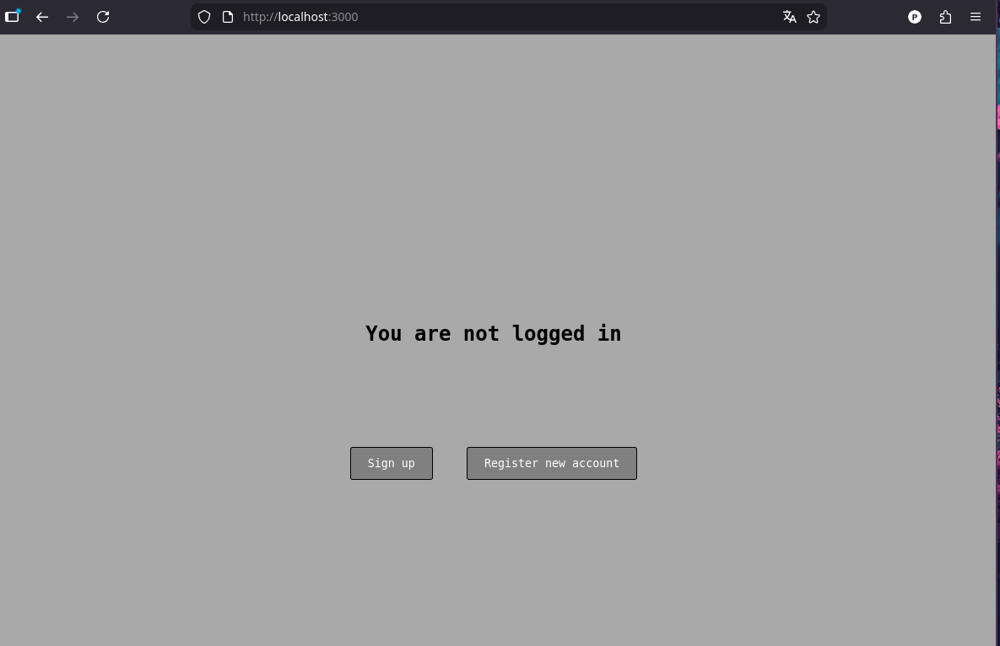
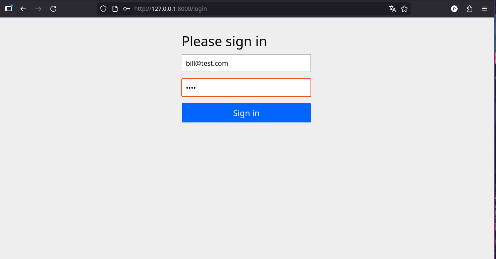
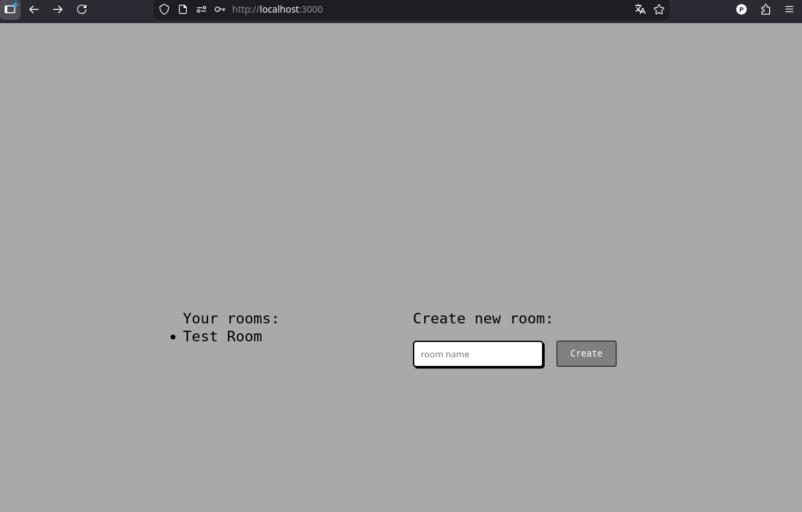
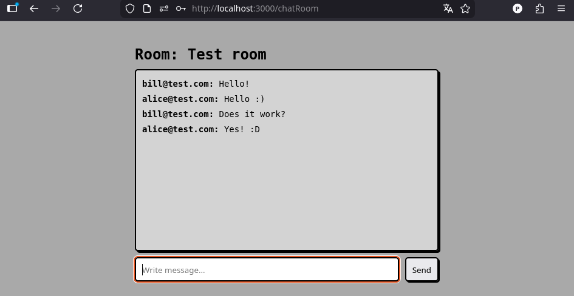

# Reactive Chat Communicator (Spring / React / RabbitMQ)

A real-time chat application built with a modular multi-service backend, designed to demonstrate practical backend engineering skills.
This repository is intended for technical reviewers and recruiters.

## Key Goals of The Project

Showcase proficiency with Spring Boot, Spring Security, OAuth2 flow, and WebFlux.

Demonstrate the ability to implement microservice architecture, including:
- gateway pattern,
- service-to-service communication,
- reactive programming,
- security,
- data persistence,
- websockets communication.

Implement a simple React frontend to show authentication flow and room listing.
(The focus of this project is backend engineering rather than UI/UX.)

## Tech Stack

**Backend**
- Java, 
- Spring Boot,
- Spring WebFlux, 
- Spring Security, Spring Authorization Server, Spring OAuth2 client / resource server, 
- Spring Data JPA, Spring Data MongoDB (reactive), PostgreSQL
- RabbitMQ (reactive)
- WebSocket communication with frontend

**Frontend**
- React / JavaScript
- Basic UI created only for demonstration
- WebSocket communication with backend

**Other**
- Docker
- Maven

## Project Structure
The system consists of several independent microservices:

- Authorization Server: Handles user authentication (OAuth2 Authorization Code Grant flow), issues JWT tokens consumed by the gateway and backend services.

- Gateway Service: Serves as the entry point for the frontend, validates and manages tokens, forwards authenticated requests to backend services.

- User Service: Manages users data.

- Room Service: Manages chat-rooms data and relations between rooms and users.

- Chat Service: Handles real-time chat logic, broadcasts messages through RabbitMQ, forwards messages for persistence.

- History Service: Reactively consumes messages from RabbitMQ and persists them in MongoDB. Provides read-only endpoints for loading chat history.

## Screenshots
 

## Future Improvements

- more scalable architecture with backpressure, service discovery etc.
- more convenient deployment with docker 
- Observability

